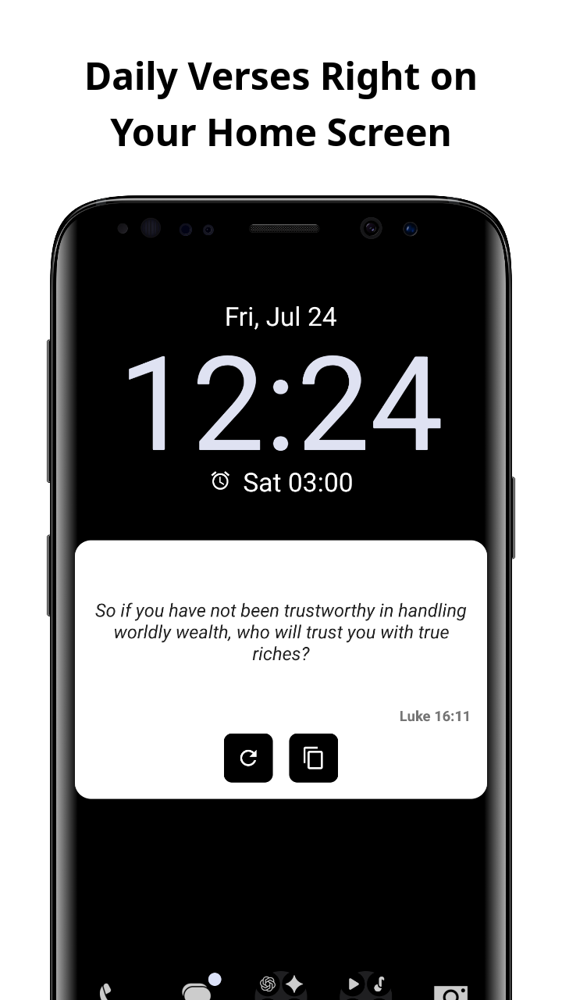
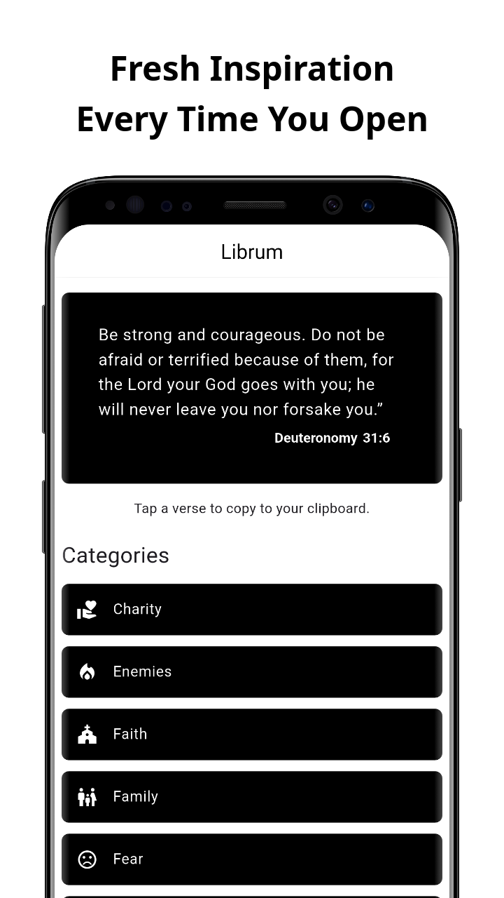
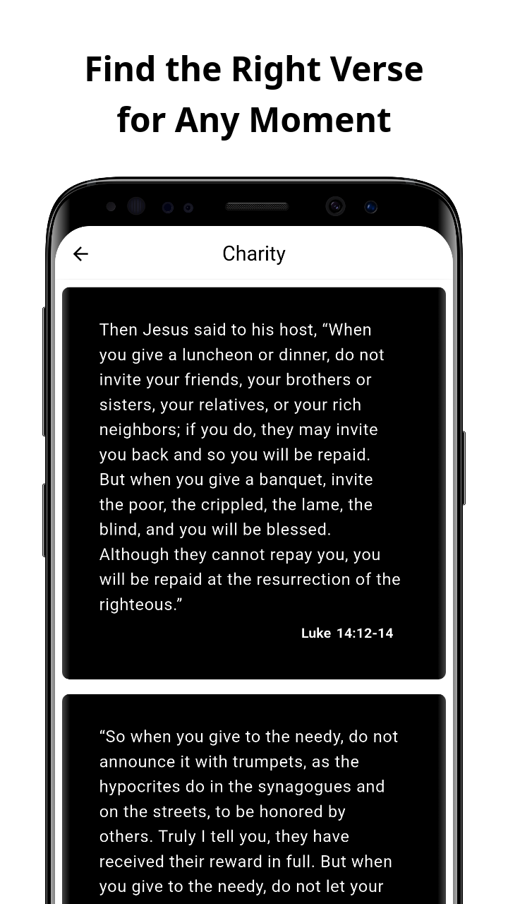

# Librum

     

Or download the latest APK from the [Releases Section](https://github.com/aldrinzigmundv/librum/releases/latest)

**This app is powered by [aldrinzigmund.com](https://www.aldrinzigmund.com/)**

## What is Librum?

Find daily hope, peace, and spiritual guidance with a 100% free and open-source Bible verse reference app. Easily explore Scripture organized by topic, share encouraging verses with friends, and keep God's Word front and center on your home screen.

## Key Features

* ✨ NEW: Home Screen Widget: Read daily Bible verses, copy text, or refresh for a new verse right from your home screen—no need to open the app.
* 📖 Categorized Verses: Easily browse Scripture by topic and category to find the exact encouragement or guidance you need.
* ⚡ Instant Daily Inspiration: Receive a fresh, random Bible verse every time you open the app.
* 📲 One-Tap Copy & Share: Quickly copy any verse to your clipboard and share inspiration directly to social media.
* 🔒 100% Free & Open-Source: Enjoy a completely private experience. Zero ads, zero tracking, and no hidden costs—ever.

## A Message from the Developer

I built this app out of my own journey seeking guidance from the Bible. Whether I was navigating life's complexities, looking for direction in difficult situations, or simply exploring Scripture out of curiosity, I always found comfort and clarity in its teachings.

In a world that often feels chaotic, I believe timeless Christian values—compassion toward adversaries, acts of charity, and the power of forgiveness—are more essential than ever. My hope is that this app brings a little extra peace and encouragement to your daily life.

## Donate

Donate XMR to Support this App

86cQoPfKTJ2bRfGH5Ts2kzaXCRcVRiX8CUHKc9xmeUmQ8YM8Uzk9S97T5gQaqYu58C9wuFK7opDH7cM9EJyR4V5LAq9RGv4