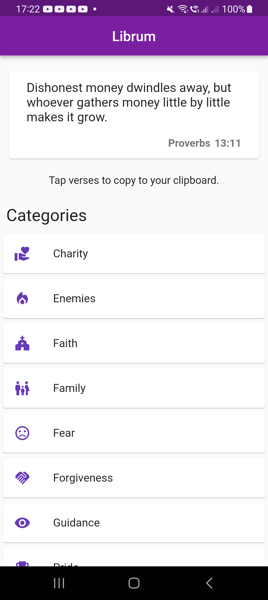

# Librum

A free and open-source Bible verse reference app. Verses are organized into different topics so you can easily find what you are looking for. Easily tap Bible verses also to copy to your clipboard for easy sharing to social media.

## Features
* Free and open-source, no tracking or whatsover
* Three random Bible verses as soon as you launch the app
* Verses organized into different topics so you can easily find what you're looking for
* Easy tap to copy so you can easily share Bible verses to social media

Or download the latest APK from the [Releases Section](https://github.com/aldrinzigmundv/librum/releases/latest)

## Donate

Donate XMR to Support this App

86cQoPfKTJ2bRfGH5Ts2kzaXCRcVRiX8CUHKc9xmeUmQ8YM8Uzk9S97T5gQaqYu58C9wuFK7opDH7cM9EJyR4V5LAq9RGv4